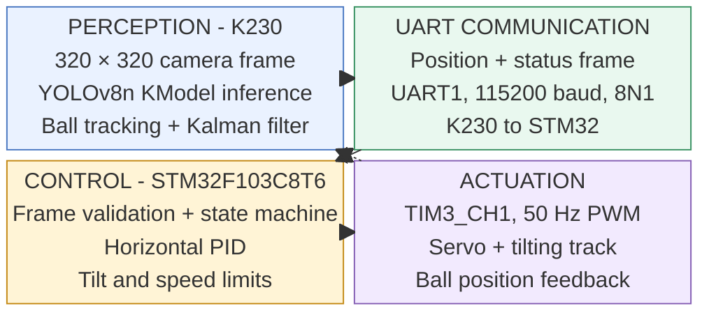
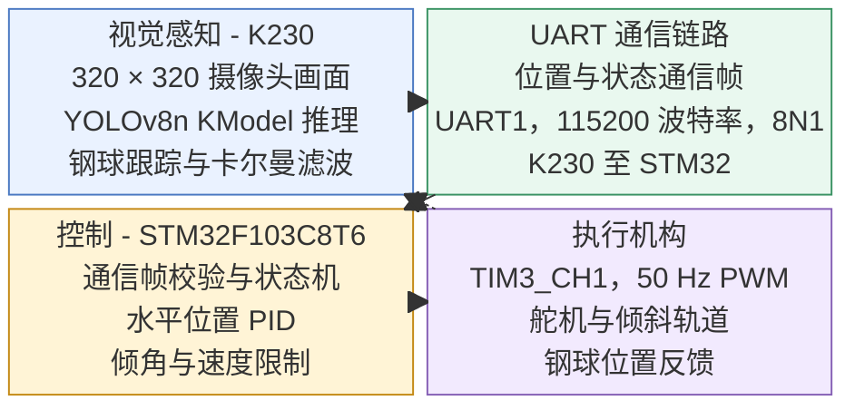

# Vision-Guided Steel Ball Balancing System

A single-axis embedded prototype that combines K230 vision, UART communication, and STM32F103 PID servo control to balance a steel ball on a tilting track.

**Project period:** July–August 2026 · **GitHub:** [@zzzy1350](https://github.com/zzzy1350)

**Hardware status:** I ran the system on K230 and MaixCAM hardware. This repository snapshot contains the K230 implementation only; the MaixCAM version and test records are not included.

**简体中文：** 本项目是一个单轴嵌入式钢球平衡原型，结合 K230 视觉、UART 通信和 STM32F103 PID 舵机控制，使钢球在倾斜轨道上保持平衡。

**项目时间：** 2026 年 7 月—8 月 · **GitHub：** [@zzzy1350](https://github.com/zzzy1350)

**硬件状态：** 我已在 K230 和 MaixCAM 硬件上运行该系统。此归档仅包含 K230 实现，不包含 MaixCAM 版本或测试记录。

## English

### Overview

The K230 processes 320 × 320 camera frames with a YOLOv8n KModel, selects and tracks the steel ball, and smooths its position with a constant-velocity Kalman filter. Position and tracking status are sent to an STM32F103C8T6 over a 115200-baud UART link. The STM32 validates incoming frames, runs a PID controller on the horizontal image error, and drives a servo through a 50 Hz PWM output to tilt a semi-circular track.

The mechanical setup is **single-axis**: the controller uses the ball’s horizontal (X) position. The Y coordinate is used for the on-screen target marker; this project does not claim two-axis balancing.

### System architecture



### Main features

- YOLOv8n KModel inference on K230 with ball tracking and short-term Kalman prediction.
- Split vision/control design: K230 estimates position; STM32 handles PID and actuation.
- Measurement, prediction, loss, and filter-reset states are exposed for debugging.
- The servo moves toward its target with a rate limit; tilt and speed are bounded.
- Communication timeout and invalid or lost coordinates disable closed-loop control and return the servo toward neutral.
- UART commands support target changes, PID tuning, direction checks, and status inspection.

### Repository layout

| Path | Contents |
| --- | --- |
| `k230/` | CanMV K230 detection, tracking, and UART runtime |
| `k230_artifacts/` | KModel and matching metadata used by the runtime |
| `keil/` | STM32F103 Keil project and embedded source |
| `keil/Control/` | PID controller and balance state machine |
| `keil/Protocol/` | K230 frame protocol and debug-console commands |
| `keil/Hardware/` | UART, PWM, servo, OLED, and status LED drivers |
| `docs/steel_ball_balance_system.md` | Wiring, deployment, commands, tuning, and bring-up notes |
| `tools/` | Dataset checks, ONNX inspection, K230 conversion, and dataset split utilities |
| `THIRD_PARTY_NOTICES.md` | Notes on bundled third-party components and rights checks |

Training images and duplicate ONNX/PyTorch model variants are not included in this snapshot.

### Hardware and software

| Component | Role / notes |
| --- | --- |
| Kendryte K230 board with camera | Runs the CanMV vision script and KModel |
| STM32F103C8T6 | Receives ball coordinates, runs PID, and generates servo PWM |
| 180-degree servo and semi-circular track | Single-axis mechanical balancing setup |
| Separate 5 V supply for the servo | Keep servo power off the MCU 3.3 V rail; connect grounds together |
| OLED and 3.3 V USB-to-TTL adapter | Local status display and PC debug UART |
| CanMV IDE / compatible K230 firmware | K230 deployment environment |
| Keil MDK-ARM | Opens `keil/Project.uvprojx`; project notes specify STM32F1 Standard Peripheral Library V3.5.0 |
| ST-Link | STM32 programming and SWD debugging |

### Build and run

1. Read the wiring and safety notes in `docs/steel_ball_balance_system.md` before powering the mechanism.
2. Copy `k230_artifacts/steel_ball_yolov8n_320_new.kmodel` to `/sdcard/models/steel_ball_yolov8n_320_new.kmodel` on the K230 SD card.
3. Copy `k230/steel_ball_yolov8n_320_k230.py` to `/sdcard/steel_ball_yolov8n_320_k230.py`. Open it in CanMV IDE and run it with compatible K230 firmware and runtime dependencies.
4. Open `keil/Project.uvprojx` in Keil MDK-ARM, build the STM32 project, and flash the STM32F103C8T6 over ST-Link/SWD.
5. Connect K230 GPIO3/UART1_TX to STM32 PA10/USART1_RX, K230 GPIO4/UART1_RX to PA9/USART1_TX, and join grounds. Both ends use 115200 baud, 8 data bits, no parity, and 1 stop bit.
6. For PC debugging, use a 3.3 V logic-level USB-to-TTL adapter on STM32 PA3/USART2_RX and PA2/USART2_TX.

Pin assignments, frame details, LED states, and full deployment instructions are in `docs/steel_ball_balance_system.md`.

### Debug UART commands

Send newline-terminated commands to the STM32 debug UART at 115200 baud, 8N1:

```text
TARGET 160 160
PID 0.060 0.003 0.020
ENABLE
DISABLE
NEUTRAL
DIRECTION 1
DIRECTION -1
STATUS
HELP
```

PID values are held in RAM and return to defaults after power cycling. See the detailed guide for command behavior and tuning sequence.

### Safe first bring-up

- Start with the servo horn or mechanical linkage disconnected. Verify the PWM period and neutral position before attaching the mechanism.
- The project notes record a nominal 100° mechanical center and a software range of 90°–110°; calibrate these limits for the actual servo and linkage.
- Power the servo from a separate regulated 5 V supply and connect its ground to the MCU/K230 ground.
- Begin tuning with low proportional gain and `Ki = 0`. Keep the software angle limits enabled and test the control direction at low gain.
- Stop if the mechanism binds, the controller resets, or the servo moves unexpectedly. Re-check wiring, power, and direction before continuing.

### Verification and limitations

I ran the system on K230 and MaixCAM hardware. This archive contains the K230 implementation only; it does not include a MaixCAM version or test records. I have not recorded quantitative detection accuracy, frame rate, settling time, or balance error.

### Data, third-party components, and license

No training-image dataset is included. Training images were sourced online; per-image source URLs and license records are not included in this archive. The repository includes a KModel and STM32/CMSIS support files. Before redistributing these models or third-party code, review `THIRD_PARTY_NOTICES.md` and confirm the applicable permissions and attribution requirements. This repository has no license file, so no blanket reuse license is provided for the code or bundled assets.

### Author

Project author and GitHub account: [zzzy1350](https://github.com/zzzy1350).

## 简体中文

### 项目简介

K230 处理 320 × 320 摄像头画面，运行 YOLOv8n KModel 并跟踪钢球，通过匀速卡尔曼滤波平滑坐标；随后经 115200 波特率 UART 把位置和跟踪状态发送给 STM32F103C8T6。STM32 校验通信帧，根据钢球水平位置误差运行 PID，并通过 50 Hz PWM 驱动舵机倾斜半圆形轨道。

当前机械结构只控制**一个轴**：PID 使用钢球的水平 X 坐标；Y 坐标用于画面目标标记。本项目不宣称实现二维平衡。

### 系统结构



### 主要功能

- K230 端运行 YOLOv8n KModel，完成钢球检测、目标跟踪和短时卡尔曼预测。
- 视觉与控制分板运行：K230 估计坐标，STM32 运行 PID 并控制舵机。
- 提供真实测量、预测、丢失和滤波器重置等状态，便于联调。
- 舵机按限速逐步接近目标角度，并根据位置误差限制倾角和速度。
- 通信超时、坐标无效或持续丢球时退出闭环，舵机缓慢回到中位附近。
- 支持串口修改目标点、PID 参数和控制方向，并查询运行状态。

### 仓库目录

| 路径 | 内容 |
| --- | --- |
| `k230/` | CanMV K230 检测、跟踪及 UART 运行脚本 |
| `k230_artifacts/` | 运行脚本所需的 KModel 及匹配元数据 |
| `keil/` | STM32F103 Keil 工程和嵌入式代码 |
| `keil/Control/` | PID 控制器和平衡状态机 |
| `keil/Protocol/` | K230 通信帧协议和串口调试命令 |
| `keil/Hardware/` | UART、PWM、舵机、OLED 和状态灯驱动 |
| `docs/steel_ball_balance_system.md` | 接线、部署、命令、调参和首次联调说明 |
| `tools/` | 数据集检查、ONNX 检查、K230 模型转换和数据集划分工具 |
| `THIRD_PARTY_NOTICES.md` | 第三方组件与授权核查说明 |

当前归档未包含训练图片集及重复的 ONNX/PyTorch 模型版本。

### 硬件与软件

| 组件 | 用途 / 说明 |
| --- | --- |
| Kendryte K230 开发板与摄像头 | 运行 CanMV 视觉脚本和 KModel |
| STM32F103C8T6 | 接收钢球坐标、运行 PID 并输出舵机 PWM |
| 180° 舵机与半圆形轨道 | 单轴平衡机械结构 |
| 独立 5 V 舵机电源 | 不要使用 MCU 的 3.3 V 引脚给舵机供电；各设备地线需共地 |
| OLED 和 3.3 V USB-TTL | 本地状态显示与电脑调试串口 |
| CanMV IDE / 兼容 K230 固件 | K230 部署环境 |
| Keil MDK-ARM | 打开 `keil/Project.uvprojx`；工程说明使用 STM32F1 标准外设库 V3.5.0 |
| ST-Link | STM32 下载与 SWD 调试 |

### 编译与运行

1. 上电前先阅读 `docs/steel_ball_balance_system.md` 中的接线和安全说明。
2. 将 `k230_artifacts/steel_ball_yolov8n_320_new.kmodel` 复制到 K230 SD 卡的 `/sdcard/models/steel_ball_yolov8n_320_new.kmodel`。
3. 将 `k230/steel_ball_yolov8n_320_k230.py` 复制到 `/sdcard/steel_ball_yolov8n_320_k230.py`，在 CanMV IDE 中打开并运行。固件和运行环境需与模型兼容。
4. 用 Keil MDK-ARM 打开 `keil/Project.uvprojx`，编译 STM32 工程，再通过 ST-Link/SWD 下载至 STM32F103C8T6。
5. K230 GPIO3/UART1_TX 接 STM32 PA10/USART1_RX；K230 GPIO4/UART1_RX 接 PA9/USART1_TX；各设备共地。两端串口均为 115200 波特率、8 数据位、无校验、1 停止位。
6. 电脑调试串口使用 3.3 V 逻辑电平 USB-TTL：STM32 PA3/USART2_RX 和 PA2/USART2_TX。

完整引脚表、通信帧、状态灯含义和部署步骤见 `docs/steel_ball_balance_system.md`。

### 调试串口命令

电脑串口助手设置为 115200 波特率、8N1，每条命令以换行结束：

```text
TARGET 160 160
PID 0.060 0.003 0.020
ENABLE
DISABLE
NEUTRAL
DIRECTION 1
DIRECTION -1
STATUS
HELP
```

PID 参数只保存在 RAM 中，断电重启后恢复默认值。命令行为和调参顺序见详细说明文档。

### 首次上电与安全

- 首次测试时拆下舵臂或断开机械连杆，先确认 PWM 周期和舵机中位，再连接机构。
- 工程说明记录的机械中位约为 100°，软件限位为 90°–110°；实际限位需按舵机和连杆结构校准。
- 舵机使用独立稳压 5 V 电源，电源地与 MCU/K230 地相连。
- 从较小的比例系数和 `Ki = 0` 开始调参，保持软件角度限位，并以低增益检查控制方向。
- 如机构卡滞、控制板复位或舵机异常动作，应停止测试，先检查接线、供电和方向。

### 验证状态与限制

已在 K230 和 MaixCAM 硬件上运行该系统。此归档仅包含 K230 实现，不包含 MaixCAM 版本或测试记录。本项目未记录检测精度、帧率、稳定时间或平衡误差等量化指标。

### 数据、第三方组件与许可证

仓库未包含训练图片集。训练图片取自网络。仓库包含 KModel 以及 STM32/CMSIS 支持文件。

### 作者

项目署名及 GitHub 账号：[zzzy1350](https://github.com/zzzy1350)。
